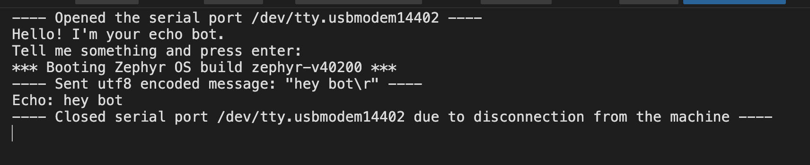

# Caso de Testes
## Eco básico:
* Entrada: hey bot
* Saída esperada: hey bot
* Critério de Aceitação: Nesse caso, é esperado que os caracteres digitados sejam repetidos de forma precisa pelo bot. Alguns amigos relataram que para uma mesma entrada pode ocorrer do echo pular uma linha ou não. Importante deixar registrado que esse caso não ocorreu nos nossos testes. 

## Linha vazia
* Entrada:   
* Saida esperada:
* Critério de Aceitação: Nesse caso, normalmente a primeira linha vazia enviada o bot entende como pular uma linha ao em vez de linha vazia, portanto apenas aparece o envio para o enconder. Já na segunda linha enviada vazia o bot responde uma linha vazia. Sendo assim, essa condição será aceita como pula de linha e seguida de linha vazia 

## Linha cheia

* Entrada: ABCDEFGHIJKLMNOPQRSTUVWXYZABCDEFGHIJKLMNOPQRSTUVWXYZ
* Saida esperada: ABCDEFGHIJKLMNOPQRSTUVWXYZABCDEFGHIJKLMNOPQRSTUVWXYZ
* Saida real: ABCDEFGHIJKLMNOPQRSTUVWXYZABCDE

* Critério de Aceitação: O  Unicode Transformation Format-8 (UTF-8) possui 8 bit, sendo assim 32 bytes de informação. Um desses bytes é o enter, portanto somente 31 caracteres pode ser enviados pelo echo. No caso dos caracteres de A-z cada um necessita de 1 byte, por isso são printadas 31 letras. Porém em alguns casos como caractéres especiais ou em outras linguas são necessários até 4 bytes 

